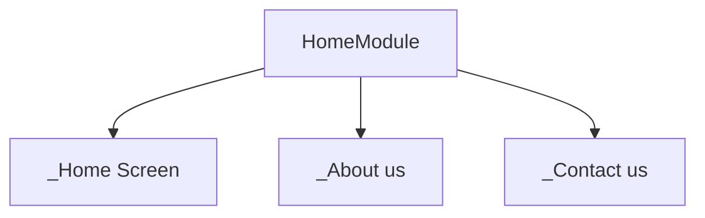

## Responsibility

- Define HomeScreen
- Define About Us Screen
- Define Contact Screen
- Manage navigation between it internal screens
- Defining screen along with their data and domain

Home:
It maintenance top level destination such as
- Home
- About us
- Contact us

Public API:
 - HomeModuleNavGraph

## Public events and state
 Event -> Client

 - onSendButtonClick
 
State -->Client
- enableSendButton

### Why it maintain its own navigation
- It has Internal NavHost so it need a separate NavController
- Managing  internal navigation to handle  back button press ,in order to  reduce the client module responsibility
- To manage separate NavGraph also help to adding new destination
without touching the the client module
- Keeping separate NavHost reduce numbers of public api
Adding or removing new screens and database connection can be done without effects client
- Can be made adapting and changes without effecting outer modules

### Other benefits
- Let `About Us`, `Contact Us` such need data from network then it's easy to change because the outer modules doesn't need to know about it

### What it does not do

- Since it doesn't know about image or media or report form or other destination so we not do anything send from here
- Though here is send button ,so it doesn't implement the send functionality

- The sending has some condition such as network IO, form validation, known the form data and media data, media compression, etc
- So if we send from here then this module responsible for many task then it has many reasons to change,it then no more single responsibilities.

- So it just propagate event of sending,then client will send

### enableSendButton
 - It might possibly sometimes send button needed to be `disabled `such as on sending or for temporary to avoid conseucative   multiple click or for other reasons that is why it options for disabled send

### Managing permissions 
- It managed platform dependent permissions for it components exam as before sending notifications is permissions is needed so it will ask for the notification permission
- Managing permission here instead of while sending data 
- because permissions UI related so it need UI `Context` while the send data is business logic, so in future we may move the send to to another business module in that case if we use permission on send data then business+ ui logic will be together which is not good , that's why managing permission here.
