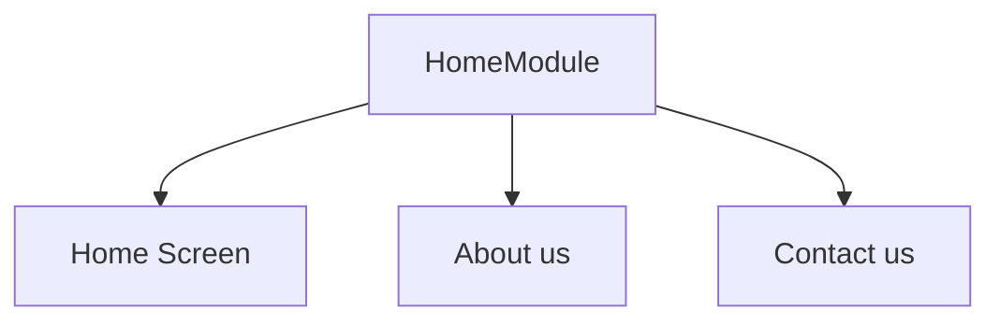

## Responsibility

- Define HomeScreen
- Define About Us Screen
- Define Contact Screen
- Manage navigation between it internal screens



Home Screen Event to HomeModule :
- onSendRequest
- onAboutUsRequest
- onContactUsRequest


```kotlin

_HomeDestination(

    onSendRequest: () -> Unit = {},
    onAboutUsRequest: () -> Unit = {},

    ) 
```

Managing it own internal navigation so that back button presss can handle and it reduce the client module responsibilty.
to manage separate nav graph also help to adding new destination
without touching the the clinet module