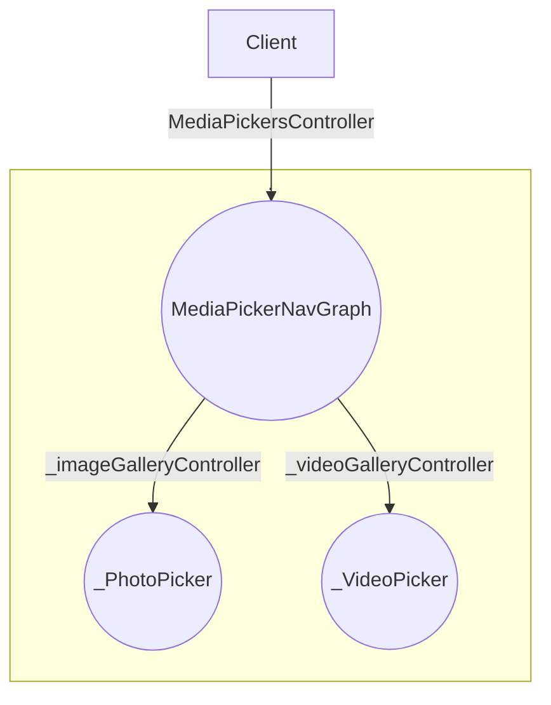

Responsible
to pick the media and give to the client
it will not responsible for send,or compression
so that it responsibility is less,so it easy to test and maintain

### Documentation conventions
- "_ " used to denote the internal or private 

## How to use this module as client

## About this module

- It managed it component permissions so it needs platform specific code.
- It exposed the media controller because the controller has access to media state as a result it depends on client how long  it want to persevere the media.

- It has data layer to send media and notifications about media,
- Since these destination will be used as top  level such as with bottom bar or nav rail  so it doesn't define own NavHost, because own NavHost need separate nav controller, that is why it definite the graph only to reducing the client responsibility

- It doesn't hold the reference of nav controller to avoid memory leak that is why it has function for navigate so the nav controller used when needed and doesn't store reference

## Implementation Guide
#### Use Factory Design Pattern

- use factory to avoid directly created instance because we may  change implementation later and also we don't want the client module does know about unnecessary detail or dependency

- if we directly use constructor or field dependency injection then the client need to pass those dependency, and if implementation change then client need to pass separate dependency so we don't want that is why using a factory to maintain single source of truth of changes
