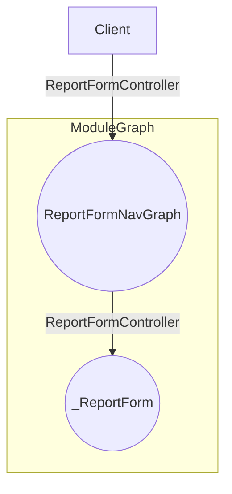

## About this module

- Define the Report Form and the form components
- Define the form controller but does not manage it
- It able to  change the report form style,design and other without affecting client.

- Since there's are not many ui or screen to this module, only single screen so it manages the adaptive ui as well as the send data to the servers
- It has adaptive layout for compact and larger screens
- It managed the permission that needed for it such as location permissions,and permission are platform dependent so use the expect-actual 


## Public APIs
- Destination
- FormController
- 

### Documentation conventions
- "_ " used to denote the internal or private 

## How to use this module as client




## Client responsibility in order to use it
- Since `FORM` data should preserve util the app death that is why the client need to persevere it state 


### Implementation Guide


- Make some variables and functions internal even though the class will be used by client

- Use `Factory Design pattern` for creating controlled or sending to network so that it loose  coupled because we want dependency inversion if we do so then the client need to pass the dependency in that case the client have more and unnecessary responsibility.to reduce that use factory so that implementation can be changed or replaced from only single place

## Why using  Factory Design pattern

- Consider the following scenario 
- Where we need to `Data Utils`  
- Neither `iOS `support `java` code nor `Kotlin` has  own `Date Utilities`
- So we need a platform specific implementation


So let a define a common agreement as follows by using `interface` or `expect` class

```kotlin
expect class DateUtilsCustom {

    public fun getCurrentDate():String

    fun getDate(milliseconds: Long): String

}

```

Now consider the following client class that wants to use  this `DateUtils` and the`client class` is within this module.

```kotlin
class ReportFormControllerImpl(private val dateUtil: DateUtilsCustom) :ReportFormController{
   
}

```
To gain loose couping we want to inject the `DateUtilsCustom`.

Now let consider this component

```kotlin
@Composable
fun ReportForm(
    formStateManager: ReportFormController,
    -------
) {
  ----
-------

}

```

- The client  has only access to the the `ReportForm`
- To maintain the life cycle of the the form state and control the event client must need to pass the `ReportFormControllerImpl`
- But in order to create the `ReportFormControllerImpl` ,client need to  create the `DateUtilsCustom` instance first
- However the the `DateUtilsCustom` is  itself the platform dependent
- More ever  the neither use the `DateUtilsCustom` directly or it has access to the form state and event,the client need to create the `DateUtilsCustom` in order to create the `ReportFormControllerImpl` and `ReportFormControllerImpl` need to use in order to use the `ReportForm`

what is the solution?
- If client directly create the `ReportFormControllerImpl` then the client need to write extra unnecessary code 
- or import some external dependencies
- both the solution is fine ,if the code is small but what is for the larger problem or what is we have the same kind of small small problem in different module
- in that case the the client module has take either some extra responsibility or unnecessary coupled with external dependencies

how `Factory` pattern going to solve the problem
- Create the factory within this module
- and provide the instance of `ReportFormControllerImpl` to the client module
- No matter how complex logic is to create the `ReportFormControllerImpl` now the client does not need to worry about it
- More ever now this module can hide the `DateUtilsCustom` from 
client module because it does not need to the client 
- Now if we change or modify the the internal structure or creation of `ReportFormControllerImpl` or `DateUtilsCustom`  then the client code will not have to change,because we can change in the factory
- Because of the factory we have single source of truth of creation of `ReportFormControllerImpl


